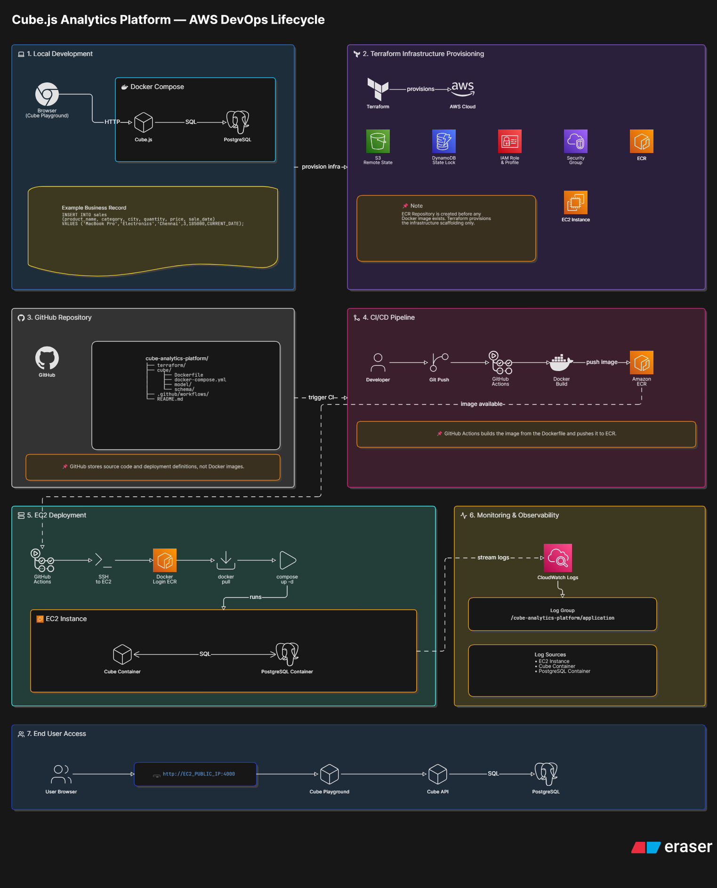

# Cube.js Analytics Platform on AWS

Production-style analytics platform built using **Cube.js**, **PostgreSQL**, **Docker**, **Terraform**, **GitHub Actions**, **Amazon ECR**, and **EC2** following modern DevOps deployment practices.

The project demonstrates the complete lifecycle of a containerized analytics application from local development to automated deployment on AWS infrastructure.

---

# Architecture



---

# Project Goals

This project was built to demonstrate:

- Infrastructure as Code using Terraform
- Containerized application deployment using Docker
- CI/CD automation using GitHub Actions
- Container registry management using Amazon ECR
- Automated deployment to EC2
- CloudWatch integration for monitoring and observability
- End-to-end AWS DevOps lifecycle implementation

---

# High Level Architecture

The deployment flow follows the pattern below:

```text
Developer
    │
    ▼
Git Push
    │
    ▼
GitHub Actions
    │
    ├── Build Docker Image
    ├── Push Image to Amazon ECR
    └── Deploy to EC2
                    │
                    ▼
            Docker Compose
                    │
          ┌─────────┴─────────┐
          ▼                   ▼
      Cube.js            PostgreSQL
          │                   │
          └──── SQL Queries ──┘
```

---

# Repository Structure

```text
cube-analytics-platform/
│
├── cube/
│   ├── cube/
│   │   └── model/
│   │       ├── cubes/
│   │       └── views/
│   │
│   ├── docker-compose.yml
│   └── postgres/
│       └── init.sql
│
├── terraform/
│   ├── main.tf
│   ├── variables.tf
│   ├── outputs.tf
│   ├── providers.tf
│   ├── versions.tf
│   ├── terraform.tfvars
│   └── user-data.sh
│
├── .github/
│   └── workflows/
│       └── deploy.yml
│
├── docs/
│   └── architecture.png
│
├── Dockerfile
│
└── README.md
```

---

# Local Development

## Start Services

```bash
cd cube

docker compose up -d
```

Verify containers:

```bash
docker ps
```

Expected containers:

- Cube.js
- PostgreSQL

---

## Access Cube Playground

```text
http://localhost:4000
```

---

# Example Dataset

Example insert statement:

```sql
INSERT INTO sales
(
    product_name,
    category,
    city,
    quantity,
    price,
    sale_date
)
VALUES
(
    'MacBook Pro',
    'Electronics',
    'Chennai',
    3,
    185000,
    CURRENT_DATE
);
```

Cube.js automatically generates analytical SQL queries against PostgreSQL based on the defined semantic model.

---

# Infrastructure Provisioning

Terraform provisions:

- VPC
- Public Subnet
- Internet Gateway
- Route Table
- Security Group
- IAM Role
- IAM Instance Profile
- EC2 Instance
- Amazon ECR Repository
- CloudWatch Log Group

Provision infrastructure:

```bash
cd terraform

terraform init

terraform plan

terraform apply
```

Destroy infrastructure:

```bash
terraform destroy
```

---

# CI/CD Pipeline

Deployment is fully automated using GitHub Actions.

Pipeline workflow:

1. Developer pushes code to GitHub.
2. GitHub Actions runner starts.
3. Docker image is built.
4. Image is pushed to Amazon ECR.
5. Workflow connects to EC2 through SSH.
6. EC2 pulls latest image from ECR.
7. Docker Compose recreates containers.

---

## Workflow Sequence

```text
Git Push
    │
    ▼
GitHub Actions
    │
    ▼
Docker Build
    │
    ▼
Amazon ECR
    │
    ▼
SSH into EC2
    │
    ▼
docker compose pull
docker compose up -d
```

---

# Required GitHub Secrets

The pipeline expects the following repository secrets:

| Secret | Purpose |
|--------|---------|
| AWS_ACCESS_KEY_ID | AWS authentication |
| AWS_SECRET_ACCESS_KEY | AWS authentication |
| AWS_REGION | AWS region |
| ECR_REPO | ECR repository URI |
| EC2_HOST | EC2 public IP |
| EC2_USER | EC2 SSH user |
| EC2_SSH_KEY | EC2 private key |

---

# Deployment Verification

Verify containers:

```bash
docker ps
```

Verify Cube:

```text
http://EC2_PUBLIC_IP:4000
```

Verify logs:

```bash
docker logs cube
docker logs postgres
```

---

# Monitoring and Observability

CloudWatch Log Group:

```text
/cube-analytics-platform/application
```

Potential log sources:

- EC2 system logs
- Cube container logs
- PostgreSQL container logs

Current implementation focuses on infrastructure creation.

Future iterations can stream application logs directly into CloudWatch using Docker logging drivers or CloudWatch Agent.

---

# Current Scope

This project intentionally focuses on:

- Infrastructure provisioning
- Container orchestration
- Deployment automation
- Registry management
- Basic observability

The goal is to demonstrate the DevOps lifecycle rather than production scale architecture.

---

# Production Improvements

A real production deployment would introduce several architectural improvements.

## Networking

Current:

- Single VPC
- Single public subnet
- Public EC2 instance

Production:

- Multi-AZ VPC
- Public and private subnets
- NAT Gateway
- Bastion Host or Session Manager
- Private application instances

---

## Compute

Current:

- Single EC2 instance
- Docker Compose

Production:

- ECS Fargate
- ECS EC2
- Amazon EKS
- Auto Scaling Groups

---

## Database

Current:

- PostgreSQL container running on EC2

Production:

- Amazon RDS PostgreSQL
- Multi-AZ deployment
- Automated backups
- Read replicas

---

## Security

Current:

- SSH access open to internet
- Public application endpoint

Production:

- Restricted security groups
- AWS Systems Manager Session Manager
- AWS WAF
- Secrets Manager
- IAM least privilege policies

---

## Availability

Current:

- Single instance deployment

Production:

- Multi-AZ deployment
- Load Balancer
- Auto Scaling
- Health checks

---

## Observability

Current:

- CloudWatch Log Group

Production:

- CloudWatch Metrics
- CloudWatch Alarms
- Prometheus
- Grafana
- Distributed tracing

---

## CI/CD

Current:

- GitHub Actions deploying directly to EC2

Production:

- Blue/Green deployments
- Canary deployments
- Automated rollback strategy
- Artifact versioning
- Multiple environments

---

# Design Decisions

## Why ECR?

ECR acts as the central image registry allowing EC2 instances to pull immutable container images during deployment.

---

## Why Docker Compose?

Docker Compose provides a lightweight orchestration layer suitable for learning environments and small deployments.

---

## Why Terraform?

Terraform ensures infrastructure is version controlled, reproducible and auditable.

---

## Why EC2 instead of ECS?

EC2 was selected to expose lower-level operational concepts including:

- Container runtime management
- Docker networking
- IAM instance profiles
- SSH based deployments
- Host level troubleshooting

---

# Future Roadmap

Potential enhancements:

- Remote Terraform State using S3
- DynamoDB state locking
- Route53 integration
- ACM certificates
- Application Load Balancer
- HTTPS support
- ECS migration
- RDS migration
- Auto Scaling
- Prometheus and Grafana integration
- Multi-environment deployment strategy
- Kubernetes migration using EKS

---

# Technology Stack

| Layer | Technology |
|------|------------|
| Infrastructure | Terraform |
| Compute | EC2 |
| Container Runtime | Docker |
| Registry | Amazon ECR |
| CI/CD | GitHub Actions |
| Analytics Layer | Cube.js |
| Database | PostgreSQL |
| Monitoring | CloudWatch |
| Cloud Provider | AWS |

---

# Author

Built as an end-to-end AWS DevOps learning project demonstrating infrastructure provisioning, containerization, deployment automation, and observability practices using modern cloud-native tooling.